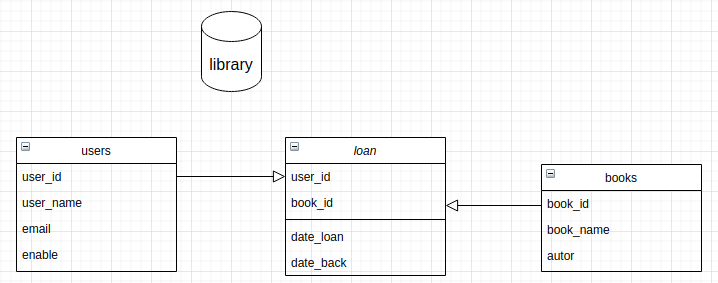

# basic_crud_indice

> This repository aims to list the basic CRUD'S made for training and studies.

---

## CRUD 

# [MySQL](https://github.com/LeonardoJosedaSilveira/basic_crud_mysql)

### Case study

> A person has some books at home and lends them to friends and wants software to manage loans.
---

### Business rules

> 1 - User email must be unique.
> 
> 2 - The book will be borrowed for 7 days.
> 
> 3 - Loan renewal for 3 days.

---

## Bank diagram

